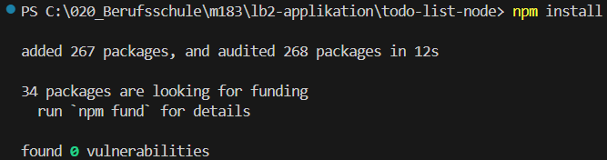

# LB2

### 1

Was macht die package-lock.json Datei im root Verzeichnis vom Projekt mit diesem Inhalt?

```json
{
  "name": "lb2-applikation",
  "lockfileVersion": 3,
  "requires": true,
  "packages": {}
}
```

### 2

`npm install` sieht gut aus



also Dependencies sollten keine Probleme geben

### 3

Start der Applikation scheint zu funktionieren


### 4

Connection is not Privat Problem (Über HTTP geht es nicht)


### 5

Muss auf unsichere Seite gehen


### 6

Fehler beim Login, wenn ich den zurück Button klicke


### 7

Alert beim Login → noch in DEV Mode 


### 8

Username wird geloggt → muss das sein?


### 9

Suche und UserId wird geloggt (Datenschutz ?)


### 10

Wenn es den Task nicht gibt, bekomme ich einfach kein Resultat = Endlos Search?

