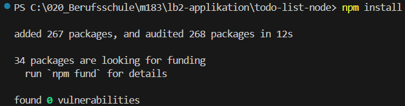

# Auswertung

## Zusammenfassung

Web Application Firewall funktioniert, ansonsten gäbe es Probleme:
- Fehlende Input Validation (An mehreren Stellen im Code)
- XSS in tasklist.js und edit.js
- Noch einige mehr (einige davon sind in den folgenden Punkten beschrieben)

Ohne diese WAF wäre die Applikation relativ unsicher, mit der WAF werden viele Probleme behoben und das obwohl es nur 2 Zeilen Code sind für diese WAF.

## Schwachstellen

### Cookies

In den Cookies werden Username und UserId gespeichert - bisschen heikel.

### Zugriff auf fremde Ressourcen

`search.js`

Es ist möglich das ein Benutzer Tasks von einem anderen Benutzer anzeigen kann, da die UserId nicht validiert wird aus der Abfrage (Code verlässt sich darauf, dass Client-Side die richtige Id schickt)

### SQL-Injection


SQL-Injection möglich: `index.js search/v2 Zeile 11`


### Rate-Limiting

Rate-Limiting ist zwar wie in den Tests ersichtlich beim login implementiert aber sonst nicht vorhanden.

### 16 Cross-Site Request Forgery

Cross-Site Request Forgery (CSRF) in backgroundsearch.js

## Folgendes funktioniert oder ist wurde gut umgesetzt

(Das ist eine unvollständige Liste die nicht alles aufzählt)

### Passwort

Passwort-Regeln beim Registrieren (Mindestlänge, Komplexität)

```
Your password must contain:
    At least 8 characters
    At least 3 of the following:
        Lower case letters (a-z)
        Upper case letters (A-Z)
        Numbers (0-9)
        Special characters (e.g. !@#$%^&*)
```

Sind gut und das Login mit einem Google Account via MFA funktioniert

### Cookies

Cookie-Sicherheit (HttpOnly, Secure, SameSite Flags)

- Secure:true
- SameSite:"None"
- HostOnly:true
- HttpOnly:true

Sieht gut aus.

### Packages

`npm install` sieht gut aus



also Dependencies sollten keine Probleme geben

### Start der App

Start der Applikation scheint zu funktionieren


## Anmerkungen und Fragen

### 1

Was macht die package-lock.json Datei im root Verzeichnis vom Projekt mit diesem Inhalt?

```json
{
  "name": "lb2-applikation",
  "lockfileVersion": 3,
  "requires": true,
  "packages": {}
}
```

### 2

Connection is not Privat Problem (Über HTTP geht es nicht)


### 3

Muss auf unsichere Seite gehen


### 4

Fehler beim Login, wenn ich den zurück Button klicke


### 5

Alert beim Login → noch in DEV Mode 


### 6

Username wird geloggt → muss das sein?


### 7

Suche und UserId wird geloggt (Datenschutz ?)


### 8

Wenn es den Task nicht gibt, bekomme ich einfach kein Resultat = Endlos Search?


